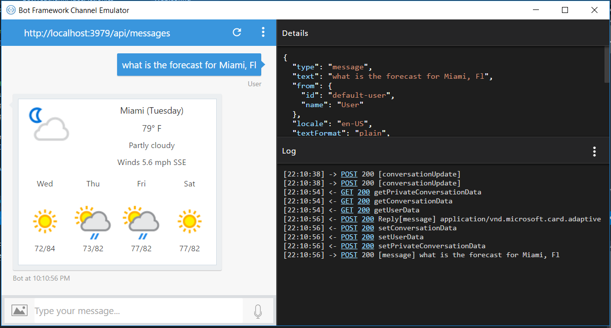
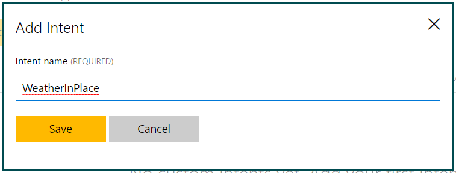
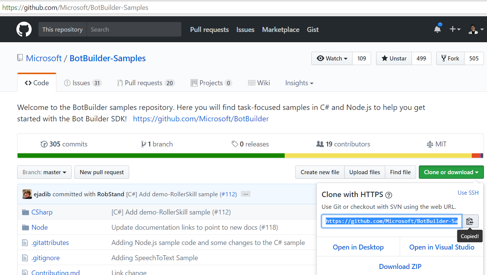
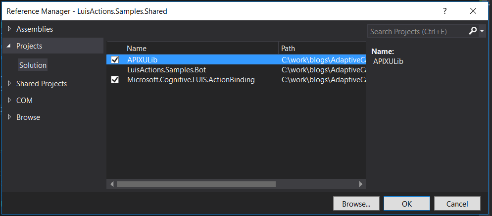

# Adaptive Card Weather Bot

## Prerequisites: 
* [Free luis.ai account](https://www.luis.ai/)
* [Bot Framework Emulator](https://emulator.botframework.com/)
* [Free APIXU account](https://www.apixu.com/)

## C# Prerequisites:

* [Visual Studio 2017 or 2015 Community](https://www.visualstudio.com/downloads/) (update all extensions)

## Node Prerequisites:

* [Node.js with NPM](https://nodejs.org/en/download/)
* [Visual Studio Code](https://code.visualstudio.com/)

## Summary

This example explains how to retrieve and display an **Adaptive Card** showing the weather by using the **LUIS Action Bindings Sample's** GetWeatherInPlace Action. We will walk through setting up the **LUIS Model**, creating the solution, and modifying the code to display a weather card using data retrieved from the **APIXU** weather service.



## LUIS Setup

Documentation for LUIS can be found here: [https://docs.microsoft.com/en-us/azure/cognitive-services/luis/home](https://docs.microsoft.com/en-us/azure/cognitive-services/luis/home)

1) Create a new LUIS app, naming it whatever you like.



2) Click on intents on the left menu to add an Intent named WeatherInPlace.
Add utterances.   
 I added the utterances:   
"what is the weather like in hong kong"   
"what is the weather like in mexico city"  
"tell me the weather in jerusalem"  
"what is the weather in miami, fl"  
"what temperature is it in paris, france"  
"weather in dallas, texas"  
"what is the weather in seattle, wa"  



3) Click on entities i the left menu and add prebuilt entity then select the **geography** entity.



4) Add a custom entity with the name **Place** and for Entity type select **Composite.**  Now click **Add child** select **geography** from the dropdown.



5) Add a phrase list for weather synonyms. try adding ""weather",  "forecast" "warm", "Rain".  This will enable asking more varied questions, such as: "what is the temperature in Miami, FL?" or "How warm is it in Philadelphia, PA?"



6) Finally, retrieve the LUIS **subscription id**  which can be found under my keys in the top menu, and **application id** which can be found under then dashboard section of the left menu.  They'll be placed in the web.config later.

7) Now **Train** and **Publish** the model.  
The exported model should look something like this:

```json

{
  "luis_schema_version": "2.1.0",
  "versionId": "0.1",
  "name": "WeatherInPlace",
  "desc": "",
  "culture": "en-us",
  "intents": [
    {
      "name": "None"
    },
    {
      "name": "WeatherInPlace"
    }
  ],
  "entities": [],
  "composites": [
    {
      "name": "Place",
      "children": [
        "geography"
      ]
    }
  ],
  "closedLists": [],
  "bing_entities": [
    "geography"
  ],
  "actions": [],
  "model_features": [
    {
      "name": "Weather synonyms",
      "mode": true,
      "words": "weather,climate,rain,winter,temperature,forecast,warm,hot,rainy,cold,colder,snow",
      "activated": true
    }
  ],
  "regex_features": [],
  "utterances": [
    {
      "text": "what is the weather like in hong kong",
      "intent": "WeatherInPlace",
      "entities": [
        {
          "entity": "Place",
          "startPos": 28,
          "endPos": 36
        }
      ]
    },
    {
      "text": "what is the weather like in mexico city",
      "intent": "WeatherInPlace",
      "entities": [
        {
          "entity": "Place",
          "startPos": 28,
          "endPos": 38
        }
      ]
    },
    {
      "text": "tell me the weather in jerusalem",
      "intent": "WeatherInPlace",
      "entities": [
        {
          "entity": "Place",
          "startPos": 23,
          "endPos": 31
        }
      ]
    },
    {
      "text": "what is the weather in miami, fl",
      "intent": "WeatherInPlace",
      "entities": [
        {
          "entity": "Place",
          "startPos": 23,
          "endPos": 31
        }
      ]
    },
    {
      "text": "what temperature is it in paris, france",
      "intent": "WeatherInPlace",
      "entities": [
        {
          "entity": "Place",
          "startPos": 26,
          "endPos": 38
        }
      ]
    },
    {
      "text": "weather in dallas, texas",
      "intent": "WeatherInPlace",
      "entities": [
        {
          "entity": "Place",
          "startPos": 11,
          "endPos": 23
        }
      ]
    },
    {
      "text": "what is the weather in seattle, wa",
      "intent": "WeatherInPlace",
      "entities": [
        {
          "entity": "Place",
          "startPos": 23,
          "endPos": 33
        }
      ]
    }
  ]
}


```
## C# Solution Setup

The **Bot Builder Samples** and **APIXU C# Library** are available on GitHub. 

1) Use git to pull the [Bot Builder Samples](https://github.com/Microsoft/BotBuilder-Samples) 

[https://github.com/Microsoft/BotBuilder-Samples.git](https://github.com/Microsoft/BotBuilder-Samples.git)



2) Do the same for the [APIXU csharp](https://github.com/apixu/apixu-csharp) library.

[https://github.com/apixu/apixu-csharp.git](https://github.com/apixu/apixu-csharp.git)



3) Open the LuisActionBinding solution from the \BotBuilder-Samples\CSharp\Blog-LUISActionBinding\ folder.

4) Remove the LuisActions.Samples.Console, .Web and .Nuget projects. 



5) Make the .Bot project the solution Startup Project.



6) Add the **APIXU** C# library project to the solution.  It's in the \apixu-csharp\APIXULib\ folder.  Once added, reference the project in the .Bot and .Shared projects.



7) Add the **Adaptive Cards** Nuget package to the .Bot and .Shared projects.


8)Update Microsoft.Bot.Builder to version 3.8.1 in nugget package manager.  Also restore packages if you have not already.   
9) Change the keys in the .Bot project's web.config to be your keys obtained from **LUIS** and **APIXU**.

```xml
<add key="LUIS_SubscriptionKey" value="LUISSUbscriptionKey" />
<add key="LUIS_ModelId" value="LUISModelId" />
<add key="APIXUKey" value="APIXUKey" />
```

## C# Code

Open the **GetWeatherInPlaceAction.cs** file in the .Shared project and change it to the following:

```cs

namespace LuisActions.Samples
{
    using System;
    using System.Threading.Tasks;
    using Microsoft.Cognitive.LUIS.ActionBinding;
    using AdaptiveCards;
    using APIXULib;
    using System.Configuration;

    [Serializable]
    [LuisActionBinding("WeatherInPlace", FriendlyName = "Get the Weather in a location")]
    public class GetWeatherInPlaceAction : GetDataFromPlaceBaseAction
    {
        public override Task<object> FulfillAsync()
        {
            var result = GetCard(this.Place);
            return Task.FromResult((object)result);
        }

        private static AdaptiveCard GetCard(string place)
        {
            WeatherModel model = new Repository().GetWeatherData(ConfigurationManager.AppSettings["APIXUKey"], GetBy.CityName, place, Days.Five);

            var card = new AdaptiveCard();
            if (model != null)
            {
                if (model.current != null)
                {
                    card.Speak = $"<s>Today the temperature is {model.current.temp_f}</s><s>Winds are {model.current.wind_mph} miles per hour from the {model.current.wind_dir}</s>";
                }

                if (model.forecast != null && model.forecast.forecastday != null)
                {
                    AddCurrentWeather(model, card);
                    AddForecast(place, model, card);
                    return card;
                }
            }
            return null;
        }
        private static void AddCurrentWeather(WeatherModel model, AdaptiveCard card)
        {
            var current = new ColumnSet();
            card.Body.Add(current);

            var currentColumn = new Column();
            current.Columns.Add(currentColumn);
            currentColumn.Size = "35";

            var currentImage = new Image();
            currentColumn.Items.Add(currentImage);
            currentImage.Url = GetIconUrl(model.current.condition.icon);

            var currentColumn2 = new Column();
            current.Columns.Add(currentColumn2);
            currentColumn2.Size = "65";

            string date = DateTime.Parse(model.current.last_updated).DayOfWeek.ToString();

            AddTextBlock(currentColumn2, $"{model.location.name} ({date})", TextSize.Large, false);
            AddTextBlock(currentColumn2, $"{model.current.temp_f.ToString().Split('.')[0]}° F", TextSize.Large);
            AddTextBlock(currentColumn2, $"{model.current.condition.text}", TextSize.Medium);
            AddTextBlock(currentColumn2, $"Winds {model.current.wind_mph} mph {model.current.wind_dir}", TextSize.Medium);
        }
        private static void AddForecast(string place, WeatherModel model, AdaptiveCard card)
        {
            var forecast = new ColumnSet();
            card.Body.Add(forecast);

            foreach (var day in model.forecast.forecastday)
            {
                if (DateTime.Parse(day.date).DayOfWeek != DateTime.Parse(model.current.last_updated).DayOfWeek)
                {
                    var column = new Column();
                    AddForcastColumn(forecast, column, place);
                    AddTextBlock(column, DateTimeOffset.Parse(day.date).DayOfWeek.ToString().Substring(0, 3), TextSize.Medium);
                    AddImageColumn(day, column);
                    AddTextBlock(column, $"{day.day.mintemp_f.ToString().Split('.')[0]}/{day.day.maxtemp_f.ToString().Split('.')[0]}", TextSize.Medium);
                }
            }
        }
        private static void AddImageColumn(Forecastday day, Column column)
        {
            var image = new Image();
            image.Size = ImageSize.Auto;
            image.Url = GetIconUrl(day.day.condition.icon);
            column.Items.Add(image);
        }
        private static string GetIconUrl(string url)
        {
            if (string.IsNullOrEmpty(url))
                return string.Empty;

            if (url.StartsWith("http"))
                return url;
            //some clients do not accept \\
            return "https:" + url;
        }
        private static void AddForcastColumn(ColumnSet forecast, Column column, string place)
        {
            forecast.Columns.Add(column);
            column.Size = "20";
            var action = new OpenUrlAction();
            action.Url = $"https://www.bing.com/search?q=forecast in {place}";
            column.SelectAction = action;
        }

        private static void AddTextBlock(Column column, string text, TextSize size, bool isSubTitle = true)
        {
            column.Items.Add(new TextBlock()
            {
                Text = text,
                Size = size,
                HorizontalAlignment = HorizontalAlignment.Center,
                IsSubtle = isSubTitle,
                Separation = SeparationStyle.None
            });
        }

    }
}
```
Open the RootDialog in the .Bot project, and change the WeatherInPlaceActionHandlerAsync method:

```cs

[LuisIntent("WeatherInPlace")]
public async Task WeatherInPlaceActionHandlerAsync(IDialogContext context, object actionResult)
{
	IMessageActivity message = null;
	var weatherCard = (AdaptiveCards.AdaptiveCard)actionResult;
	if (weatherCard == null)
	{
		message = context.MakeMessage();
		message.Text = $"I couldn't find the weather for '{context.Activity.AsMessageActivity().Text}'.  Are you sure that's a real city?";
	}
	else
	{
		message = GetMessage(context, weatherCard, "Weather card");
	}

	await context.PostAsync(message);
}

```
Add the **GetMessage** method:

```cs
private IMessageActivity GetMessage(IDialogContext context, AdaptiveCards.AdaptiveCard card, string cardName)
{
    var message = context.MakeMessage();
    if (message.Attachments == null)
        message.Attachments = new List<Attachment>();

    var attachment = new Attachment()
    {
        Content = card,
        ContentType = "application/vnd.microsoft.card.adaptive",
        Name = cardName
    };
    message.Attachments.Add(attachment);
    return message;
}
```
## Node Solution Setup

1) npm install in the \BotBuilder-Samples\Node\blog-LUISActionBinding\samples\ folder. ???

2) 

## Run the Bot

You should now be able to run the project, and debug your bot with the **Emulator**.  See [here](https://github.com/Microsoft/BotFramework-Emulator/wiki/Getting-Started#connect-to-a-bot-running-on-localhost) for instructions.

